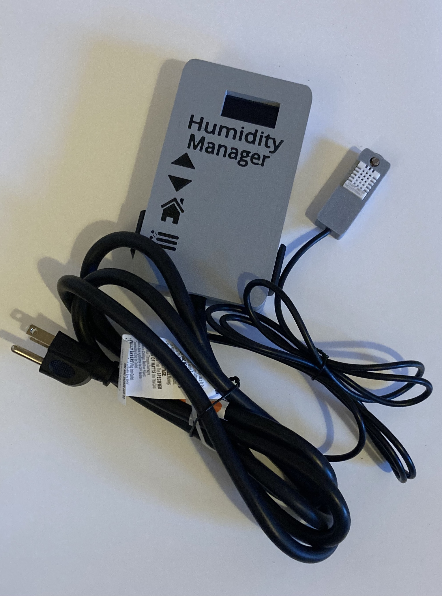
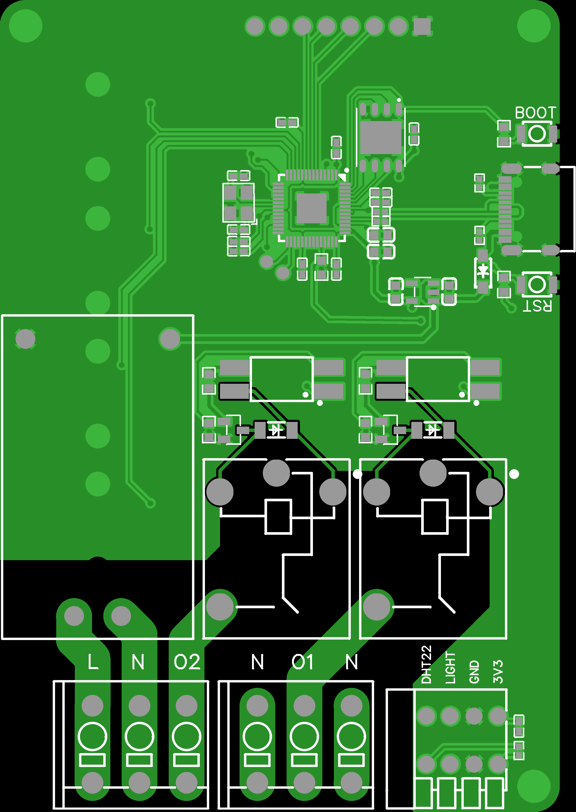
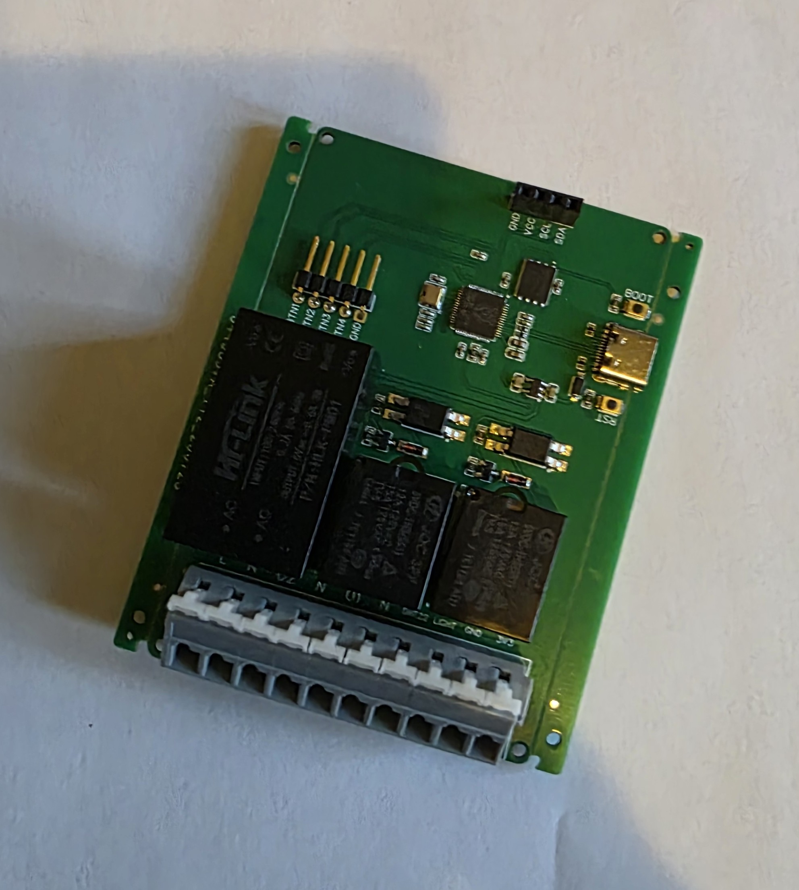
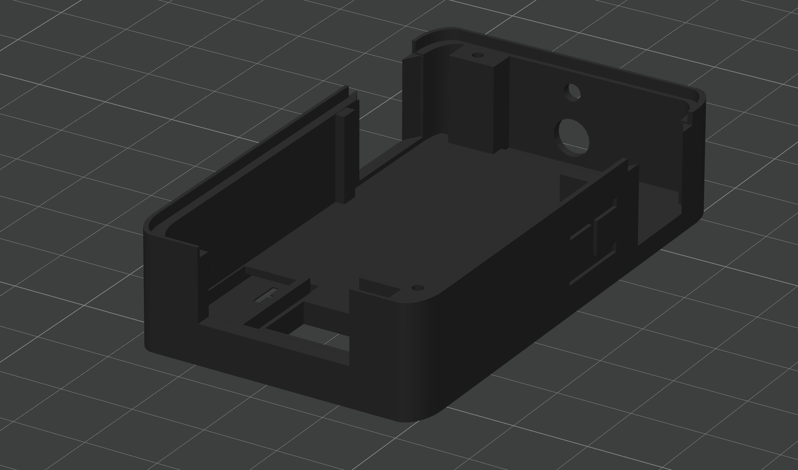

# Environmental Controller

Dual-relay humidity and vapor pressure deficit (VPD) controller built around a custom ESP32 PCB, with hysteretic control, OLED menu UI, and EEPROM-persisted settings. End-to-end project: firmware, schematic, 2-layer PCB layout, and 3D-printed enclosure, all designed and built from scratch.



---

## What it does

Reads temperature and relative humidity from a DHT22 sensor and ambient light from an analog photoresistor, computes vapor pressure deficit (VPD) on the fly, and switches two AC relays — one driving a humidifier, one driving a dehumidifier — to hold a target VPD during the day and a target relative humidity at night. Day/night transitions are detected automatically from the ambient light sensor. Four pushbuttons and a 128×64 OLED display provide a local menu UI for setting targets, sensor offsets, and display preferences. All user settings are persisted to EEPROM and restored on power-up.

Applications for a VPD/humidity controller of this class include greenhouse and horticulture environments, cleanroom and storage humidity control, museum and archive climate control, and any enclosed space where temperature-compensated humidity targeting is preferable to raw RH control.

---

## Hardware

**Microcontroller:** ESP32 (bare chip, QFN package) soldered directly to the board rather than a drop-in module. Onboard USB-to-serial IC handles programming and debug. BOOT and RESET buttons are broken out to the board edge.

**Sensors:**
- DHT22 (AM2302) digital temperature and humidity sensor
- Analog photoresistor for ambient light / day–night detection

**Output stage:**
- Two 5V mechanical relays switching 120 VAC mains loads
- Flyback diodes on each relay coil for back-EMF protection
- Slot cutout between the low-voltage logic section and the AC mains section for creepage clearance isolation

**User interface:**
- SSH1106 128×64 I2C OLED display
- Four momentary pushbuttons (up, down, back, next/settings)

**Power and I/O:**
- 120 VAC mains input via screw terminals (L, N)
- Two switched 120 VAC output terminals (O1, O2) for humidifier and dehumidifier loads
- 3.3 V logic rail for ESP32 and sensors
- Sensor pin header breakout for DHT22, light sensor, GND, and 3V3

---

## Firmware

Arduino-framework C++ (`RewriteV4_5.ino`), targeting the ESP32 via the Arduino core. Key design decisions:

**Non-blocking main loop.** No `delay()` calls in the main execution path. Each subsystem — sensor reads, display refresh, EEPROM save check, light sensor averaging — runs on its own cadence using `millis()` deltas. This keeps the UI responsive and the control loop prompt regardless of what any one subsystem is doing.

**Hysteretic relay control with dead time compensation.** The DHT22 responds in seconds, but room air takes minutes to actually equilibrate after a humidifier or dehumidifier kicks on. Without a tolerance band around the setpoint, the fast sensor response versus slow physical response produces continuous oscillation and cycles the relays constantly. The control logic tracks which device was most recently active and uses a tolerance band to define a dead zone around the target — the relay does not re-engage until the measurement crosses the opposite side of the band. This both prevents oscillation and extends mechanical relay life.

**Sensor smoothing via moving averages.** DHT22 outputs are noisy by nature; the analog photoresistor is noisier still. Each sensor feeds a 10-sample ring buffer, and control decisions are made against the average rather than the instantaneous reading.

**EEPROM wear protection.** The save routine fires on a 30-second timer but only performs EEPROM writes if any stored value has actually changed since the last save. This bounds EEPROM cycling to actual user interaction and prevents flash wear from the periodic poll.

**Independent day and night control modes.** Day mode targets VPD (a combined function of temperature and humidity); night mode targets relative humidity directly. Mode switches automatically from the light sensor reading with a configurable cutoff threshold.

**State-machine UI.** A `SettingsScreenState` byte drives a six-screen menu (VPD target, humidity offset, temperature offset, leaf offset, night mode enable, night humidity target). Button mapping is context-sensitive to the active screen.

---

## PCB

Full 2-layer PCB designed in EasyEDA. Complete Gerber sets for both revisions are included in `pcb/`, ready to send to any fab house.

**Revision A — initial working board:**



Separate screw-terminal groups for mains in/out and a dedicated pin-header breakout for sensor connections. Functional but awkward to wire in the field.

**Revision B — refined layout:**



Unified terminal strip along the bottom edge for all power and sensor connections, dedicated labeled headers for the four front-panel buttons (BTN1–BTN4), and an explicit I2C header at the top (GND/VCC/SCL/SDA) for the OLED. Easier to assemble, easier to diagnose during bring-up.

Both revisions keep a slot cutout between the mains and logic sections for creepage clearance — standard safety practice for any PCB that switches AC line voltage from the same board as its low-voltage logic.

**Design history.** Initial PCB layout was attempted through two contracted specialists via freelancing platforms; neither delivered a working board. Rather than continue contracting, the layout was self-taught and done in-house — which turned out to be both faster and better matched to the actual hardware constraints.

---

## Enclosure

3D-printable enclosure designed in Fusion 360, printed on a Bambu Lab multi-color FDM printer to allow the button labels to be printed directly into the top face of the lid rather than applied as stickers or silkscreen.



The main box includes integrated PCB mounting features, a side cutout for the terminal strip, and recessed button pockets with a thin top layer — the button faces are supported from underneath by the lid rather than protruding through holes, which gives a cleaner finished look and better tactile feel.

The DHT22 and photoresistor are housed in a small separate enclosure connected to the main unit via a short cable, so the sensor can be positioned at the measurement location independently of the controller.

STL files in `enclosure/`.

---

## Repository layout

```
environmental-controller/
├── firmware/
│   └── RewriteV4_5.ino          Arduino-framework ESP32 firmware
├── pcb/
│   ├── rev_a/                   Gerbers, drill files for first board revision
│   └── rev_b/                   Gerbers, drill files for refined revision
├── enclosure/
│   ├── Box.stl                  Main enclosure body
│   ├── newTopcurveaa.stl        Top cover with button pockets
│   ├── Sensort.stl              Remote sensor housing
│   └── box6.stl                 Alt enclosure revision
├── docs/
│   └── (rendered images used in this README)
└── README.md
```

---

## Status and honest notes

This was an early self-taught embedded-systems project (2019–2022). It was my first serious firmware, first custom PCB, and first real enclosure design. The firmware is kept in its original form rather than refactored to modern practice: there are a lot of global variables, three separate copies of the moving-average logic (one for VPD, one for humidity, one for light), and variable naming is not consistent across the file. The underlying architecture — non-blocking scheduling, hysteretic control with dead-zone compensation, EEPROM wear protection, sensor smoothing, a proper menu state machine — is sound. The surface-level code style reflects someone learning C++ while building the thing.

If I were rebuilding this today, I'd encapsulate the per-sensor state into structs, collapse the three ring-buffer implementations into one reusable class, and move constants and pin assignments into a separate header. None of those changes would alter what the device does; they'd just make the source easier to maintain. For the purposes of keeping an honest record of what I built while teaching myself, the original file stays.

---

## License

MIT
